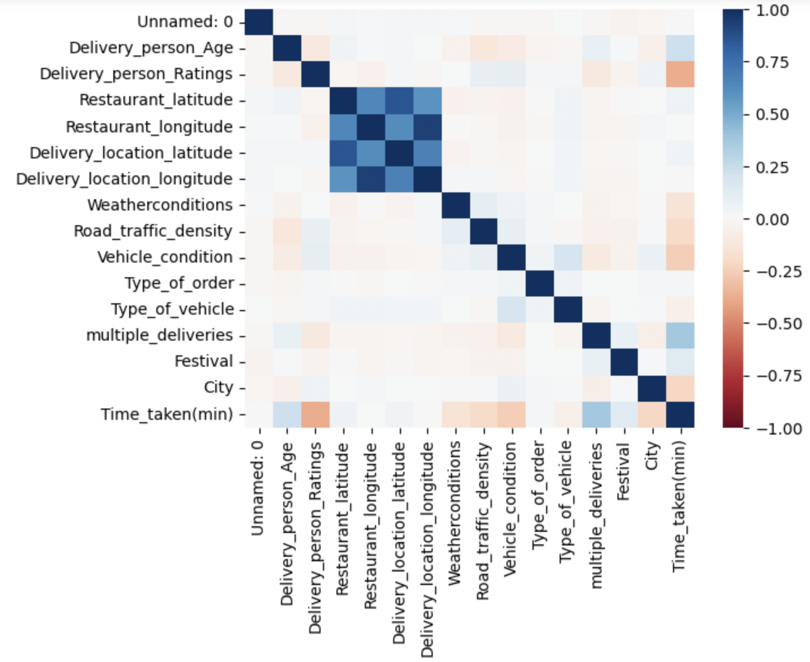

# Exploratory Data Analysis using Python Pandas

 

I used Python Pandas to perform exploratory data analysis on a publicly available Amazon Delivery dataset on Kaggle. In this dataset I
1. Explored Nulls: finding out how many nulls every column had.
2. Created another dataframe where null values from numeric columns were replaced with 0 and null values from categoricalv values were replaced with 'no_record'
3. Calcualted skewness of every int and float numeric column 
4. Used Seaborn to visualize the distribution of the following skewed variables: Delivery_person_Age and Delivery_person_Ratings
5. Used '.describe()' to quickly asses which variables have outliers by means of exmamining the distance between minimum / maximum values and the mean.
6. Used a correlation heatmap to uncover any linear relationships between variables

Data Source: https://www.kaggle.com/datasets/vikramxd/amazon-business-research-analyst-dataset

# Data Visualization using Tableau

Data Visualization can be found here: https://public.tableau.com/views/AmazonDeliveryExploratoryDataAnalysis/AmazonExploratoryDataAnalysis?:language=en-US&:display_count=n&:origin=viz_share_link

